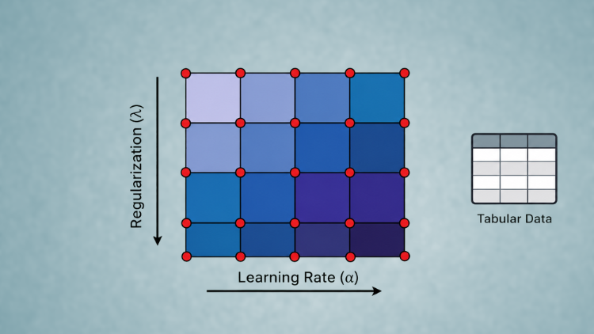

[](https://github.com/solegalli/master-hyperparameter-optimisation-for-tabular-learning/blob/master/LICENSE)
[](https://www.trainindata.com/)

# Hyperparameter Tuning for Machine Learning

Learn how to tune machine-learning models systematically—from grid and random search to Bayesian optimization, Optuna, successive halving, and Hyperband.

This repository contains the practical notebooks for the **[Master Hyperparameter Optimization for Tabular Learning](https://www.trainindata.com/p/master-hyperparameter-optimization-for-tabular-learning)** course. The examples focus on classification and tabular machine learning using scikit-learn, XGBoost, LightGBM, and Optuna.

**Released:** August 2026  
**Status:** Actively maintained

[](https://www.trainindata.com/p/master-hyperparameter-optimization-for-tabular-learning)

## What you will learn

- Select appropriate evaluation metrics and cross-validation strategies.
- Build reproducible manual, grid, and random searches.
- Understand Gaussian-process, SMAC, and TPE optimization.
- Accelerate expensive searches with pruning and multi-fidelity methods.
- Optimize scikit-learn, XGBoost, and LightGBM models with Optuna.
- Compare algorithms and hyperparameters in a single CASH workflow.

## Course contents

1. [**Hyperparameter optimization overview**](Section-01-Hyperparamter-Overview)
   - Response surfaces
   - Low effective dimensionality

2. [**Metrics**](Section-02-Metrics)
   - Classification metrics: accuracy, precision, recall, ROC AUC, and more
   - Regression metrics: MSE, RMSE, R², and more
   - Custom metrics and optimization objectives

3. [**Cross-validation**](Section-03-Cross-Validation)
   - K-fold, leave-one-out, leave-p-out, and stratified cross-validation
   - Grouped and time-series cross-validation
   - Nested cross-validation

4. [**Basic search algorithms**](Section-04-Basic-Search-Algorithms)
   - Manual search
   - Grid search
   - Random search

5. **Bayesian optimization**
   - Gaussian processes
   - Random forests and gradient-boosted models with SMAC
   - Tree-structured Parzen estimators (TPE)

6. [**Multi-fidelity optimization**](Section-07-Multi-fidelity-Optimization)
   - Successive halving
   - Resource allocation and early stopping

7. [**Optimization with Optuna**](Section-08-Optuna)
   - Framework-agnostic search
   - Search evaluation and visualization
   - Successive halving and Hyperband
   - Combined algorithm selection and hyperparameter optimization (CASH)
   - SMAC through OptunaHub

## Getting started

Clone the repository, create a dedicated Python environment, and install the course dependencies:

```bash
pip install -r requirements.txt
```

Then start Jupyter and open the notebooks in numerical order.

## Course

For lectures, explanations, and the complete learning path, visit the [online course](https://www.trainindata.com/p/master-hyperparameter-optimization-for-tabular-learning).
